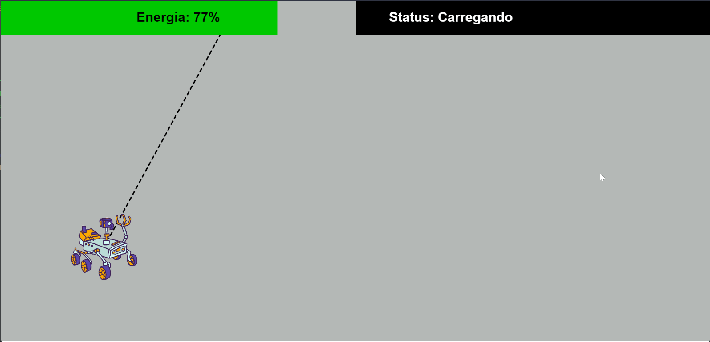

# Programação Orientada a Objetos

## Trabalho 1

O trabalho 1 é sobre rotação de matrizes em Java.

## Trabalho 2

O trabalho 2 é sobre uma simulacao de um Robo Lunar:

## Trabalho 3

O trabalho 3 é sobre uma implementação de um DAO de pessoas.

### Siga instruções especificas para cada trabalho na pasta de cada um.