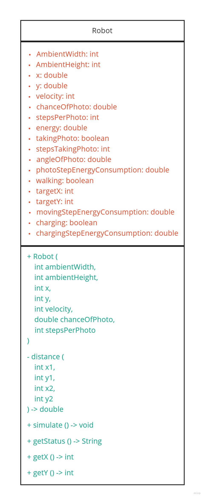

# Trabalho 2

O trabalho 2 consiste em uma simulação de Robô Lunar.


Basicamente o Robô possui uma quantidade limitada de energia, e ele precisa andar para localizações alvo no solo lunar enquanto tira fotos do ambiente. Conforme o robô anda, ele perde energia e perde mais ainda quando está tirando a fotos.

## Classe do Robô

A classe que representa o robô possui uma série de atributos que correspondem ao estado do robô.

O diagrama UML abaixo representa a classe:



## Como rodar o trabalho 2

O trabalho 2 possui a versão principal interativa construida em Javascript, utilizando a biblioteca P5.js, que permite renderizar as informações em uma página web.

Para rodar o ambiente de desenvolvimento, use o comando:

```
yarn dev
```

Para rodar a simulação em um ambiente de produção, use o comando:

```
yarn start
```

## Versão em Java

A simulacao também possui uma versão não interativa em Java localizado na pasta `Trabalho2Java`.

Para rodar o trabalho 2 versão Java execute o comando:

```
java ./Trabalho2Java/Main.java
```

Caso a sua versão de Java requira compilação, use o comando:

```
javac ./Trabalho2Java/Main.java
```

O resultado será um log com as informações do Robô em cada step da simulação:


