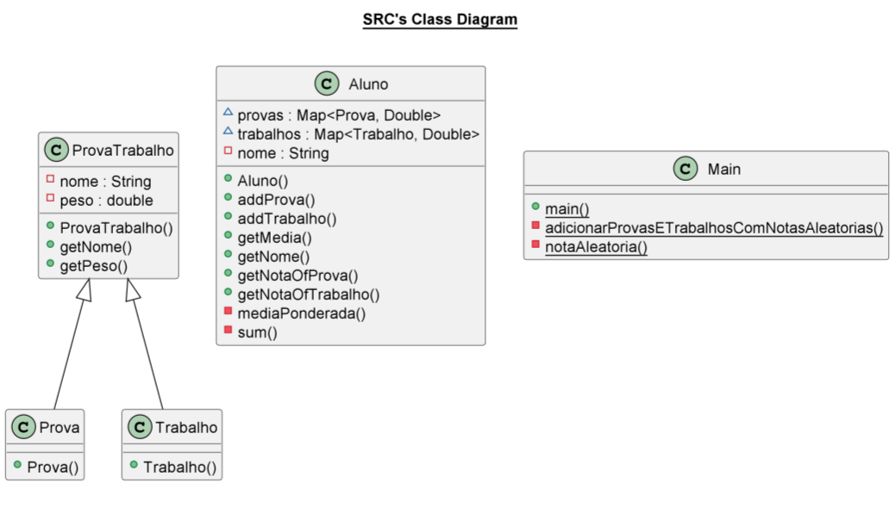

# Trabalho final

Esse trabalho se trata em calcular médias finais de alunos de uma disciplina. Os alunos possuem notas de provas e trabalhos com pesos diferentes.

O código fonte esta em *src/* e os arquivos de teste estão em *test/*.

Segue o diagrama de classes:

